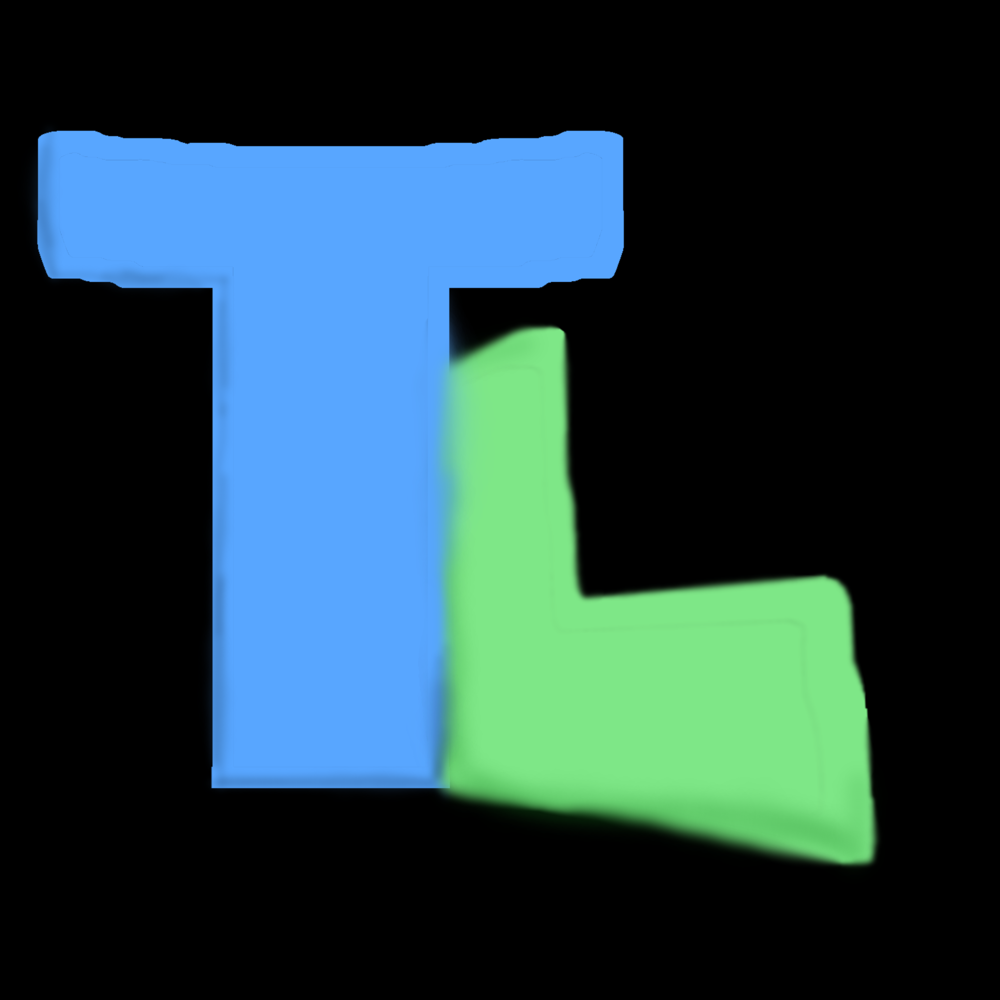

  

<h1 align="center">Toollibs</h1>

  A modular C++ framework ecosystem designed for lightweight, structured, and extensible software development.

  
  
  
  
  
  
  

  <a href="https://toolgits.github.io/Toollibs/changelog.html">Changelog</a> •
  <a href="https://toolgits.github.io/Toollibs/downloads.html">Downloads</a> •
  <a href="https://github.com/ToolGits/Toollibs/issues">Issues</a> •
  <a href="https://toolgits.github.io/Toollibs/">Website</a>

## 🏢 Official maintainer of Toollibs

Toollibs is maintained by the **ToolGits** organization:

- ToolGits: https://github.com/ToolGits
- Created by: https://github.com/enzobobdevvideos04-ctrl

---

## 🚀 Core Philosophy

Toollibs is built around a simple idea:

> Build modular systems, verify at runtime, and deploy automatically across architectures.

It focuses on:

- Clean modular design
- Cross-platform compilation (Linux + Windows support)
- Lightweight system architecture
- Developer-friendly tooling

---

## 🧠 Key Features

- ⚙️ Multi-architecture build system (x86_64, ARM, etc.)
- 🧪 Runtime verification pipeline (mainlogger system)
- 🧩 Plugin system for extensibility
- 📦 Automated deployment system (website integration)
- 💻 Linux-focused system tools (CPU/GPU modules)
- 🌐 Download + version distribution via web interface
- 📱 Official Android support available + battery_info to check your battery status
- 👨‍💻 Mini **Terminal Emulator** FS Emulated CMD (fs module tool)

---

## 🔧 Modules

- **core** → logging system, runtime control, base utilities
- **math** → mathematical helpers and vector structures
- **graphics** → lightweight rendering utilities
- **input** → input handling (keyboard, mouse, controller)
- **fs** → file system utilities
- **plugins** → modular extension system

---

## 🏗️ Build System

Toollibs uses a Makefile-based build pipeline:

- Supports multi-architecture builds
- Separates Linux-specific modules (cpu_info, gpu_info)
- Generates structured binaries per platform

Example output:
bin/x86_64/mainlogger bin/windows_x86_64/mainlogger bin/aarch64/cpu_info bin/x86_64/gpu_info

---

## 🌐 Deployment System

Toollibs includes an automated deployment pipeline:

- Builds are automatically packaged
- Binaries are distributed to a web directory
- Generates `index.json` for downloads
- Powers the official Toollibs website

---

## 🧪 Runtime Verification

Each build can be validated using the MainLogger system:

- Module integrity checks
- Math, graphics, and plugin tests
- System health report (HEALTHY / DEGRADED)

---

## 🌍 Platforms
- Linux (primary development platform)
- Windows (via MinGW for main modules)
- Android (Official support for aarch64, ARMv7l and ARMv6l)

---

## 🎯 Goal

To build a **modern, modular, and automated C++ ecosystem** that can serve as a foundation for:

- system tools
- game frameworks
- plugin-based applications
- lightweight engines

---

## 📜 History

Toollibs evolved from an earlier discontinued project called **ServerHub**.

It was rebuilt to focus on:
- stability
- structure
- continuous development
- real deployment workflow

---

## 🌱 Community

This is an open project built for learning, experimentation, and contribution.

You are welcome to:
- contribute code
- suggest improvements
- build modules
- fork and experiment freely

---

## ⚡ License

- The license that Toollibs uses is the MIT License (Copyright © 2026)